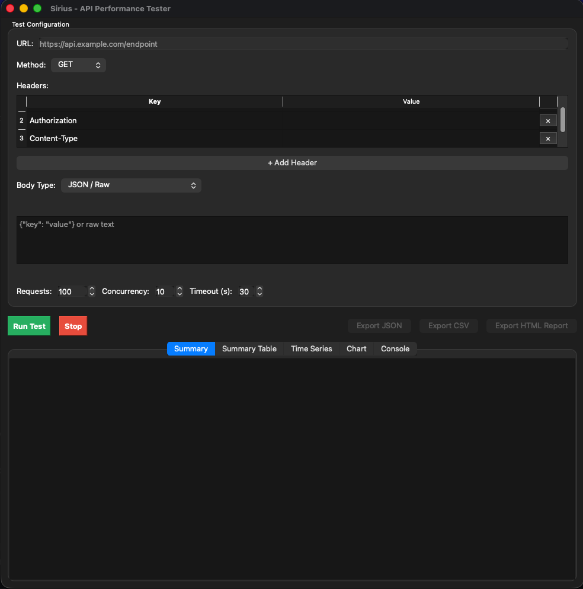
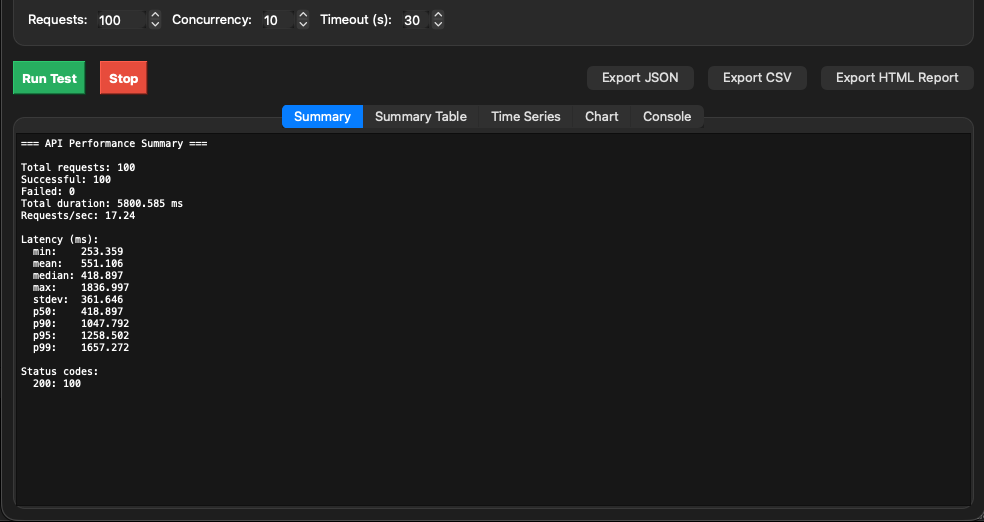
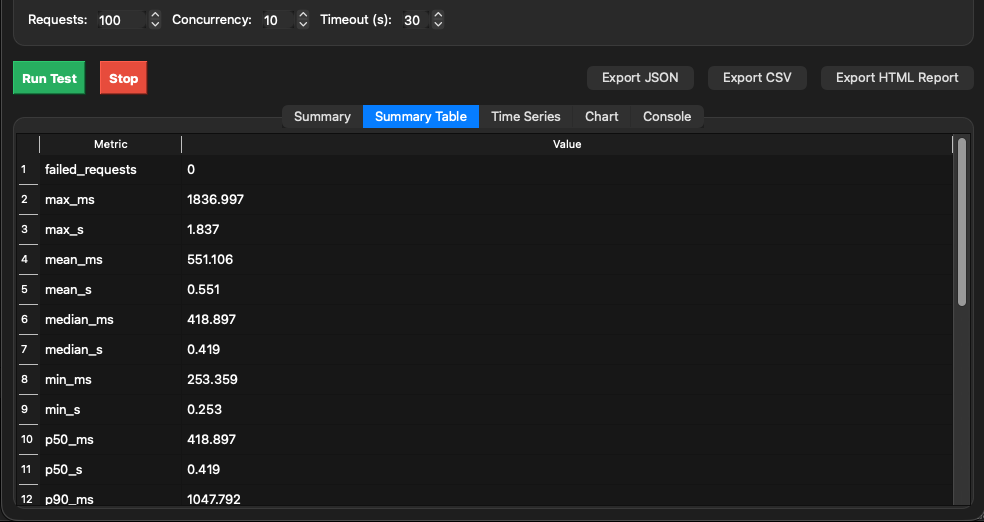
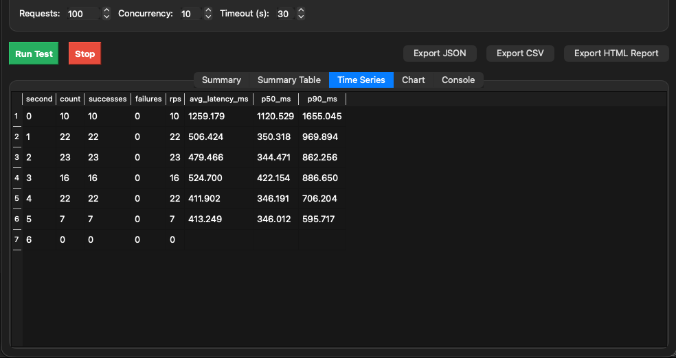
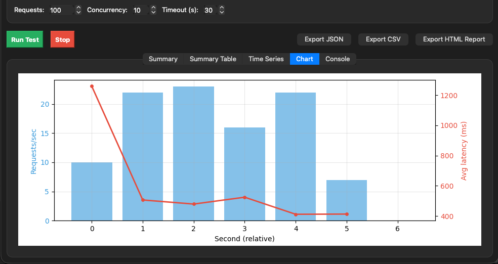
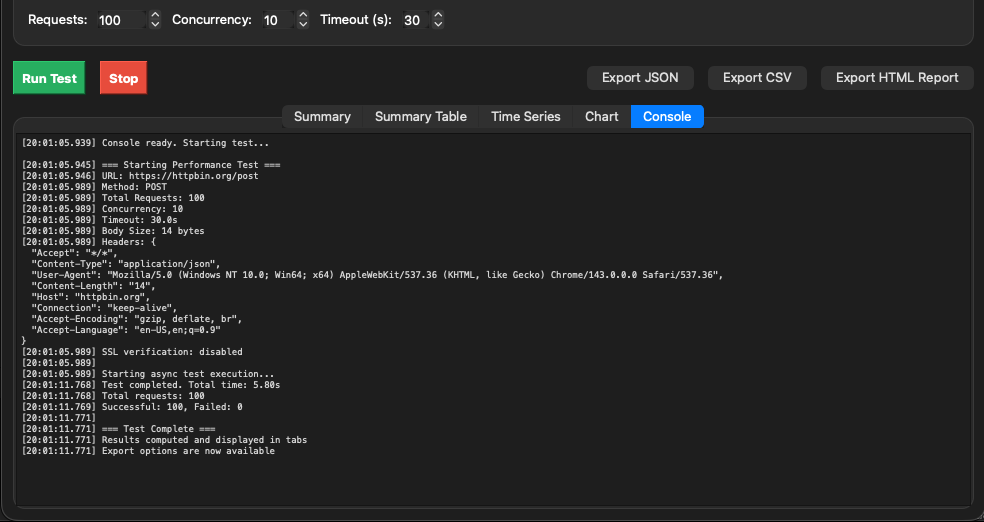

# SIRIUS - API Performance Tester - GUI Version

## Overview
This is a PyQt6-based GUI application for testing API performance. It provides an intuitive interface for configuring and running API load tests, visualizing results, and exporting reports.

## Features

- **Easy Configuration**: Simple form-based input for URL, HTTP method, headers, request body, and test parameters
- **Dynamic Headers**: Bruno/Postman-style key-value table for adding multiple headers with individual controls
- **Multiple Body Types**:
  - None (for GET requests)
  - JSON/Raw text
  - Form Data (multipart/form-data) with text fields and file uploads
- **Async Testing**: Non-blocking UI with background worker threads for running tests
- **Real-time Results**: View test results immediately in multiple formats:
  - Summary statistics (success rate, latency percentiles, throughput)
  - Tabular data view
  - Time-series analysis
  - Visual charts (with matplotlib)
- **Export Options**:
  - JSON format
  - CSV format (summary, timeseries, and per-request logs)
  - Interactive HTML reports

## Installation

### Requirements
```bash
pip install PyQt6 aiohttp
```

### Optional (for charts)
```bash
pip install matplotlib
```

## Usage

### From the gui directory:
```bash
cd gui
python sirius_gui.py
```

### Or from the project root:
```bash
python gui/sirius_gui.py
```

## GUI Components

### Input Section
- **URL**: Target API endpoint
- **Method**: HTTP method (GET, POST, PUT, DELETE, PATCH)
- **Headers**: Dynamic key-value table (like Bruno/Postman)
  - Add multiple headers with individual key-value pairs
  - Remove individual headers with × button
  - Add more headers with "+ Add Header" button
- **Body Type**: Choose from:
  - None (no request body)
  - JSON / Raw (text editor for JSON or plain text)
  - Form Data (multipart/form-data with text fields and file uploads)
- **Form Data Fields** (when Form Data is selected):
  - Key-value pairs with type selection (Text or File)
  - File browser for selecting files to upload
  - Add/remove individual fields
- **Requests**: Total number of requests to send
- **Concurrency**: Number of concurrent requests
- **Timeout**: Request timeout in seconds

### Results Section (Tabs)
1. **Summary**: Text-based summary of test results
2. **Summary Table**: Key metrics in table format
3. **Time Series**: Per-second performance data
4. **Chart**: Visual representation of throughput and latency over time

### Controls
- **Run Test**: Start the performance test
- **Stop**: Abort a running test
- **Export JSON**: Save results as JSON
- **Export CSV**: Save results as CSV files
- **Export HTML Report**: Generate interactive HTML report

## Screenshots

### Main Application Window


The main window includes:
- Progress indication during test execution
- Tabbed results view for easy navigation
- Responsive layout that works with different window sizes

### Summary Results


View test results summary with key statistics including success rate, latency percentiles, and throughput metrics.

### Summary Table View


Key metrics displayed in an easy-to-read table format.

### Time Series Analysis


Per-second performance data showing throughput and latency over time.

### Performance Charts


Visual representation of throughput and latency metrics with matplotlib integration.

### Request Logs


Detailed per-request logs for in-depth analysis.

## Troubleshooting

### "PyQt6 is not installed"
```bash
pip install PyQt6
```

### "aiohttp is not installed"
```bash
pip install aiohttp
```

### Charts not showing
Install matplotlib:
```bash
pip install matplotlib
```

### Import errors
Make sure you're running from the correct directory or use the provided launcher script.

## Project Structure

The GUI code is organized into modular files for better maintainability:

```
gui/
├── sirius_gui.py              # Main entry point
├── main_window.py             # Main window and UI logic
├── worker.py                  # Background test worker thread
├── widgets.py                 # Custom widgets (chart display)
├── requirements.txt           # Python dependencies
└── README.md                  # This file
```

**File Descriptions:**
- `sirius_gui.py`: Entry point that launches the application
- `main_window.py`: Contains `PerformanceTesterGUI` class with all UI components and event handlers
- `worker.py`: Contains `TestWorker` class that runs tests in background thread without blocking UI
- `widgets.py`: Contains `MatplotlibWidget` for displaying charts

This modular structure makes the code easier to maintain and understand compared to the original single-file version.
